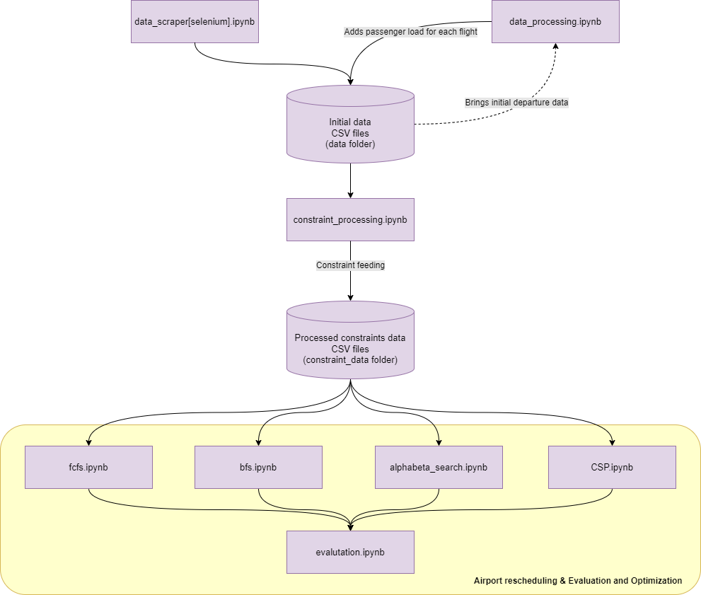

# Airport Rescheduling Optimization

## Introduction

The aviation industry faces numerous challenges, one of the most disruptive being the unexpected closure of runways. Such events can lead to significant delays, cancellations, and logistical nightmares, affecting thousands of passengers and incurring substantial economic costs. The goal of this project is to develop a robust system that can reschedule flights efficiently in the event of sudden runway closures. By leveraging search algorithms, we aim to minimize disruptions and optimize rerouting of flights with the least impact on the original schedule.

Read on to learn more about the project.

## Workflow



## Data Source

The integrity and robustness of our flight rescheduling system rely heavily on accurate and timely data. We have sourced daily-basis data from two major international airports, which are pivotal to our model due to their high traffic and significant impact on global air travel:

[Schipol Airport](https://www.schiphol.nl/en/departures/): Flight departure data are scraped from Schipol Airport Departures, which provides comprehensive details on flight schedules, delays, and cancellations. This information is crucial for understanding the baseline operations and for simulating disruptions.

[Hong Kong International Airport](https://www.hongkongairport.com/en/flights/departures/cargo.page): Additional data are collected from Hong Kong International Airport Cargo Departures, offering insights into cargo flight patterns and their interdependencies with commercial passenger flights.


The data collection process utilizes an automated web scraping. Our main tools and libraries include:
Selenium: For automated navigation and interaction with web pages, allowing us to simulate a user's actions to access and retrieve flight information.
Beautiful Soup: This library parses HTML and XML documents, making it easier to scrape information from web pages.

## Analysis Objectives

- Automated data collection
- Optimization of airport rescheduling
- Evalutation of different algorithms

## Dependencies
    ```
    asttokens=2.4.1=pyhd8ed1ab_0
    blas=1.0=mkl
    bottleneck=1.3.5=py312he558020_0
    bzip2=1.0.8=hcfcfb64_5
    ca-certificates=2023.12.12=haa95532_0
    colorama=0.4.6=pyhd8ed1ab_0
    comm=0.1.4=pyhd8ed1ab_0
    contourpy=1.2.0=pypi_0
    cycler=0.12.1=pypi_0
    debugpy=1.8.0=py312h53d5487_1
decorator=5.1.1=pyhd8ed1ab_0
exceptiongroup=1.2.0=pyhd8ed1ab_0
executing=2.0.1=pyhd8ed1ab_0
fonttools=4.47.0=pypi_0
gurobipy=11.0.0=pypi_0
importlib-metadata=7.0.1=pyha770c72_0
importlib_metadata=7.0.1=hd8ed1ab_0
intel-openmp=2023.1.0=h59b6b97_46320
ipykernel=6.28.0=pyha63f2e9_0
ipython=8.19.0=pyh7428d3b_0
ipywidgets=8.1.1=pypi_0
jedi=0.19.1=pyhd8ed1ab_0
jupyter_client=8.6.0=pyhd8ed1ab_0
jupyter_core=5.6.0=py312h2e8e312_0
jupyterlab-widgets=3.0.9=pypi_0
kiwisolver=1.4.5=pypi_0
libexpat=2.5.0=h63175ca_1
libffi=3.4.2=h8ffe710_5
libsodium=1.0.18=h8d14728_1
libsqlite=3.44.2=hcfcfb64_0
libzlib=1.2.13=hcfcfb64_5
matplotlib=3.8.2=pypi_0
matplotlib-inline=0.1.6=pyhd8ed1ab_0
mkl=2023.1.0=h6b88ed4_46358
mkl-service=2.4.0=py312h2bbff1b_1
mkl_fft=1.3.8=py312h2bbff1b_0
mkl_random=1.2.4=py312h59b6b97_0
nest-asyncio=1.5.8=pyhd8ed1ab_0
networkx=3.2.1=pypi_0
numexpr=2.8.7=py312h96b7d27_0
numpy=1.26.2=py312hfd52020_0
numpy-base=1.26.2=py312h4dde369_0
openssl=3.2.0=hcfcfb64_1
packaging=23.2=pyhd8ed1ab_0
pandas=2.1.4=py312hc7c4135_0
parso=0.8.3=pyhd8ed1ab_0
pickleshare=0.7.5=py_1003
pillow=10.2.0=pypi_0
pip=23.3.2=pyhd8ed1ab_0
platformdirs=4.1.0=pyhd8ed1ab_0
prompt-toolkit=3.0.42=pyha770c72_0
psutil=5.9.7=py312he70551f_0
pure_eval=0.2.2=pyhd8ed1ab_0
pygments=2.17.2=pyhd8ed1ab_0
pygraphviz=1.11=pypi_0
pyparsing=3.1.1=pypi_0
python=3.12.1=h2628c8c_1_cpython
python-constraint=1.4.0=pypi_0
python-dateutil=2.8.2=pyhd8ed1ab_0
python-tzdata=2023.3=pyhd3eb1b0_0
python_abi=3.12=4_cp312
pytz=2023.3.post1=py312haa95532_0
pywin32=306=py312h53d5487_2
pyzmq=25.1.2=py312h1ac6f91_0
scipy=1.11.4=pypi_0
setuptools=68.2.2=pyhd8ed1ab_0
six=1.16.0=pyh6c4a22f_0
stack_data=0.6.2=pyhd8ed1ab_0
tbb=2021.8.0=h59b6b97_0
tk=8.6.13=h5226925_1
tornado=6.3.3=py312he70551f_1
traitlets=5.14.0=pyhd8ed1ab_0
typing_extensions=4.9.0=pyha770c72_0
tzdata=2023.4=pypi_0
ucrt=10.0.22621.0=h57928b3_0
vc=14.3=hcf57466_18
vc14_runtime=14.38.33130=h82b7239_18
vs2015_runtime=14.38.33130=hcb4865c_18
wcwidth=0.2.12=pyhd8ed1ab_0
wheel=0.42.0=pyhd8ed1ab_0
widgetsnbextension=4.0.9=pypi_0
xz=5.2.6=h8d14728_0
zeromq=4.3.5=h63175ca_0
zipp=3.17.0=
    ```

